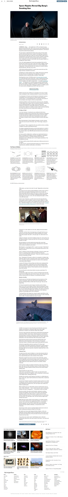

# New York Times Clone

> A cone of the New York Times website.

## Screenshot

## Live Preview

Click [here](https://raw.githack.com/aldemeery/newyork-times-clone/feature-html-layout/index.html) for a live preview.

## Authors

👤 **Gerónimo Morisot**

- Github: [@Bismarck-GM](https://github.com/Bismarck-GM)
- Twitter: [@Rewritablee](https://twitter.com/Rewritablee)
- Linkedin: [Gerónimo Morisot](https://linkedin.com/in/geronimomorisot)

👤 **Osama Aldemeery**

- Github: [@aldemeery](https://github.com/aldemeery)
- Twitter: [@aldemeery](https://twitter.com/aldemeery)
- Linkedin: [osamaaldemeery](https://linkedin.com/in/osamaaldemeery)

## 🤝 Contributing

Contributions, issues and feature requests are welcome!

Feel free to check the [issues page](issues/).

## Show your support

Give a ⭐️ if you like this project!

## 📝 License

This project is [MIT](LICENSE) licensed.
